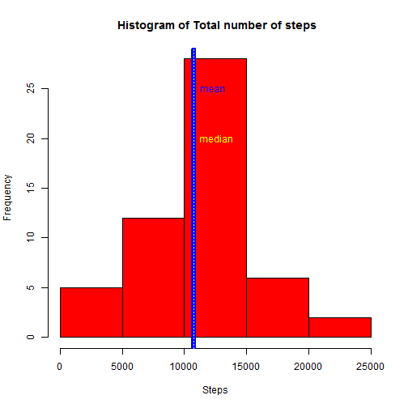
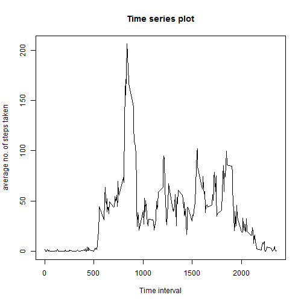
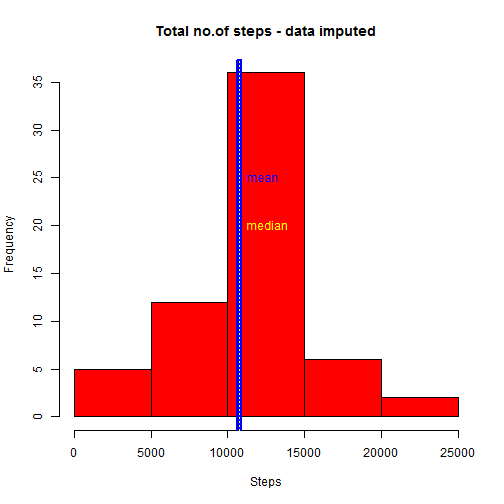
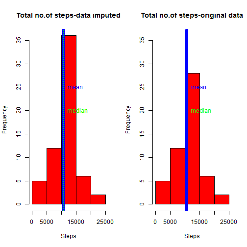
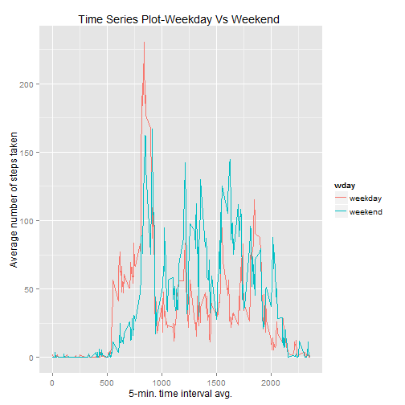

### Reproducible Research: Peer Assessment 1

## Loading and preprocessing the data

```r
data<-read.csv("activity.csv")
library(lubridate)
library(dplyr)
```

```
## 
## Attaching package: 'dplyr'
## 
## The following objects are masked from 'package:lubridate':
## 
##     intersect, setdiff, union
## 
## The following objects are masked from 'package:stats':
## 
##     filter, lag
## 
## The following objects are masked from 'package:base':
## 
##     intersect, setdiff, setequal, union
```

```r
library(ggplot2)
```

```
## Warning: package 'ggplot2' was built under R version 3.1.2
```

```r
data$date<-ymd(data$date)
acdata<-tbl_df(data)
```
For  part of the assignment, you can ignore the missing values in the dataset.

```r
actdata<-filter(acdata,!is.na(steps))
by_day<-group_by(actdata,date)
summdata<-summarize(by_day,stepsum=sum(steps))
```
## Mean and Median total number of steps taken per day

 
 ```r
  Mean<- mean(summdata$stepsum)
  Median<- median(summdata$stepsum)
  print(paste0("Mean: ", Mean))
 ```
 
 ```
 ## [1] "Mean: 10766.1886792453"
 ```
 
 ```r
  print(paste0("Median: ", Median))
 ```
 
 ```
 ## [1] "Median: 10765"
 ```

```r
hist(summdata$stepsum,col = "red",main= " Histogram of Total number of steps",xlab="Steps")
abline(v=mean(summdata$stepsum),col="blue",lwd=6)
abline(v=median(summdata$stepsum),col="yellow",lty=3)
text(Mean,25,labels="mean",col="blue",pos=4)
text(Mean,20,labels="median",col="yellow",pos=4)
```

 
Both the mean and median values are same. so they are on the same line(which I have distinguished by width and line type.)


## Average daily activity pattern

```r
by_interval<-group_by(actdata,interval)
summdata_int<-summarize(by_interval,stepmean=mean(steps))
## Make a time series plot (i.e. type = "l") of the 5-minute interval (x-axis) and the average number of steps taken, averaged across all days (y-axis)
plot(summdata_int$interval,summdata_int$stepmean,type="l",main="Time series plot",xlab="Time interval",ylab="average no. of steps taken") 
```

 

```r
## Which 5-minute interval, on average across all the days in the dataset, contains the maximum number of steps?
mdata<-filter(summdata_int,stepmean==max(stepmean))
MAX=which.max(summdata_int$stepmean)
 print(paste0("Maximum no. of steps is in ", MAX," ,",mdata$interval))
```

```
## [1] "Maximum no. of steps is in 104 ,835"
```

   
## Imputing missing values

# 1. Calculate and report the total number of missing values in the dataset (i.e. the total number of rows with `NA`s)


```r
nacdata<-summarise(acdata,n()) ## total no. of records
nactdata<-summarise(actdata,n()) ## total no. of complete records
missval<-nacdata-nactdata
print(paste0("No. of missing records: ",missval))
```

```
## [1] "No. of missing records: 2304"
```
  
# 2. Strategy for filling in all of the missing values in the dataset. 

 I have used the mean for that 5-minute interval for filling the NAs.
 For the full length of the data,loop and find if the step field is empty, if so, fill in the step with the mean of that time_interval.
 #3. Create a new dataset that is equal to the original dataset but with the missing data filled in.
 

```r
i<- 1

for (i in 1:nacdata[1,1])
  {
    if (is.na(acdata[i,1]))
    { 
      j<-acdata[i,3]                                  ##locate the interval 
      k<-filter(summdata_int,j==summdata_int[,1])     ## find the mean for that interval
                                                    ##from the calculted mean(locate it)      
      acdata[i,1]<-k[2]                           ##Replace NA with the corresponding mean value
    }
  }
```


#4. Histogram of the total number of steps taken each day and Calculate and report the **mean** and **median** total number of steps taken per day. 


```r
by_day_filled<-group_by(acdata,date)
summdata_filled<-summarize(by_day_filled,stepsum=sum(steps))
summary(summdata_filled)
```

```
##       date               stepsum     
##  Min.   :2012-10-01   Min.   :   41  
##  1st Qu.:2012-10-16   1st Qu.: 9819  
##  Median :2012-10-31   Median :10766  
##  Mean   :2012-10-31   Mean   :10766  
##  3rd Qu.:2012-11-15   3rd Qu.:12811  
##  Max.   :2012-11-30   Max.   :21194
```

 
 ```r
  Mean_f<- mean(summdata_filled$stepsum)
  Median_f<- median(summdata_filled$stepsum)
  print(paste0("Mean: ", Mean_f))
 ```
 
 ```
 ## [1] "Mean: 10766.1886792453"
 ```
 
 ```r
  print(paste0("Median: ", Median_f))
 ```
 
 ```
 ## [1] "Median: 10766.1886792453"
 ```

```r
hist(summdata_filled$stepsum,col = "red",main= "Total no.of steps - data imputed",xlab="Steps")
abline(v=mean(summdata_filled$stepsum),col="blue",lwd=6)
abline(v=median(summdata_filled$stepsum),col="yellow",lty=3)
text(Mean,25,labels="mean",col="blue",pos=4)
text(Mean,20,labels="median",col="yellow",pos=4)
```

 
 #Do these values differ from the estimates from the first part of the assignment? What is the impact of imputing missing data on the estimates of the total daily number of steps?

The difference is that in the second part, the frequency increases considerably - as there are no NAs
To see the difference-


```r
par(mfrow=c(1,2))
res<-hist(summdata_filled$stepsum,col = "red",main= "Total no.of steps-data imputed",xlab="Steps")
res
```

```
## $breaks
## [1]     0  5000 10000 15000 20000 25000
## 
## $counts
## [1]  5 12 36  6  2
## 
## $density
## [1] 1.639344e-05 3.934426e-05 1.180328e-04 1.967213e-05 6.557377e-06
## 
## $mids
## [1]  2500  7500 12500 17500 22500
## 
## $xname
## [1] "summdata_filled$stepsum"
## 
## $equidist
## [1] TRUE
## 
## attr(,"class")
## [1] "histogram"
```

```r
yl<-max(res$counts)
abline(v=mean(summdata_filled$stepsum),col="blue",lwd=6)
abline(v=median(summdata_filled$stepsum),col="green",lty=3)
text(Mean,25,labels="mean",col="blue",pos=4)
text(Mean,20,labels="median",col="green",pos=4)

hist(summdata$stepsum,col = "red",main= "Total no.of steps-original data",xlab="Steps",ylim=c(0,yl))
abline(v=mean(summdata$stepsum),col="blue",lwd=6)
abline(v=median(summdata$stepsum),col="green",lty=3)
text(Mean,25,labels="mean",col="blue",pos=4)
text(Mean,20,labels="median",col="green",pos=4)
```

 

## Are there differences in activity patterns between weekdays and weekends?
For this part the `weekdays()` function may be of some help here. Use
the dataset with the filled-in missing values for this part.

#1. Create a new factor variable in the dataset with two levels -- "weekday" and "weekend" indicating whether a given date is a weekday or weekend day.

```r
acdata$day <- weekdays((acdata$date))
i<-1
for (i in 1:nacdata[1,1])
{
  acdata$wday[i]="weekday"
  if (acdata$day[i]=="Sunday"| acdata$day[i]=="Saturday")
    acdata$wday[i]="weekend"
}
```

#1. Make a panel plot containing a time series plot (i.e. `type = "l"`) of the 5-minute interval (x-axis) and the average number of steps taken, averaged across all weekday days or weekend days (y-axis). The plot should look something like the following, which was created using **simulated data**:

```r
by_wday<-group_by(acdata,interval,wday)
summdata_wday<-summarize(by_wday,stepmean=mean(steps))
g<-ggplot(summdata_wday,aes(x=interval,y=stepmean,group=wday,color=wday))
g+geom_line()+ggtitle("Time Series Plot-Weekday Vs Weekend ")+xlab("5-min. time interval avg.")+ylab("Average number of steps taken")
```

 
